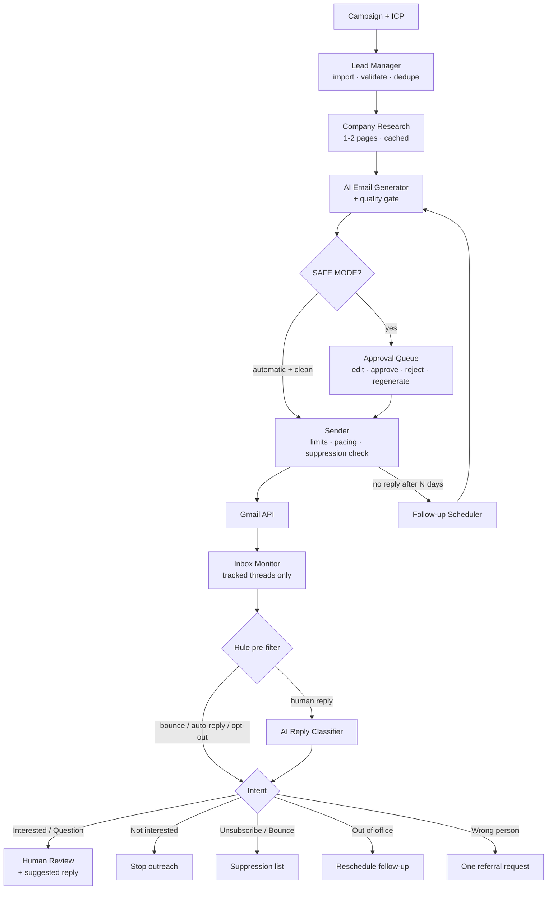

# AI Sales Outreach Agent

**A supervised, autonomous B2B cold-email system that runs for €0/month.**

Give it a product and a target market; it researches companies from their public websites,
writes short personalised emails, sends them through the official Gmail API (after your
approval), watches for replies, classifies them with an LLM, drafts sensible responses,
schedules polite follow-ups, stops contacting people who aren't interested, and escalates
interested leads to a human. Everything is tracked in SQLite and a Streamlit dashboard.

> Built as a portfolio project with a focus on software engineering: layered architecture,
> type hints, 170+ tests, safe defaults, cost-aware AI usage and responsible-outreach controls.

  

---

## Contents

- [Screenshots](#screenshots) · [Features](#features) · [Architecture](#architecture) · [Tech stack](#technology-stack)
- [Quick start (demo, no keys needed)](#quick-start-demo-mode-no-api-keys-needed)
- [Installation](#installation) · [Gemini setup](#gemini-setup-free) · [Groq setup](#groq-setup-free) · [Gmail OAuth setup](#gmail-oauth-setup)
- [Environment variables](#environment-variables) · [Running](#running-the-application) · [Scheduling](#scheduling-jobs) · [Tests](#running-tests)
- [Cost optimisation](#cost-optimisation) · [Security](#security-considerations) · [Responsible outreach](#responsible-outreach--compliance)
- [Limitations](#limitations) · [Future improvements](#future-improvements)

## Screenshots

> _Placeholder - add your own after running the demo (`python run.py demo` then `python run.py dashboard`)._

| Overview | Email approval queue | Replies & classification |
|---|---|---|
| `docs/screenshots/overview.png` | `docs/screenshots/queue.png` | `docs/screenshots/inbox.png` |

## Features

| Area | What it does |
|---|---|
| **Campaigns** | Product, value proposition, ICP (industry, size, locations, roles), tone, CTA, daily limit, follow-up timing, automatic-mode toggle, start/pause/stop. One cached AI call turns the brief into an ideal-customer profile. |
| **Leads** | CSV upload (comma/semicolon, header aliases, BOM, Excel encodings), pasted lists, manual form. Invalid rows are reported, never crash the import. Dedupe by normalised email, company domain, and company + contact. |
| **Research** | Fetches the homepage + at most one "about/services" page, respects robots.txt, rate-limits, caps size and time, blocks internal addresses (SSRF-safe, re-checked on every redirect), strips nav/cookie/footer noise, sends ≤3,500 chars to the AI for a JSON summary. Research is stored once and reused for other leads on the same domain. |
| **Email writing** | Short, plain emails from campaign + lead + research. Python adds greeting, signature and opt-out line. Deterministic quality gate flags placeholders, invented numbers, links, hype, fake case studies, length problems - retries once, then falls back to a safe template. |
| **Approval** | **SAFE MODE (default)**: every email waits in the dashboard queue - preview, edit, approve, reject, regenerate. **AUTOMATIC MODE** requires `SAFE_MODE=false` *and* campaign opt-in, and still holds back anything with quality warnings. |
| **Sending** | Gmail API with OAuth2; follow-ups and replies stay in the original thread (`threadId`, `In-Reply-To`, `References`). Daily global + per-campaign limits, minimum spacing, kill switch, atomic claim to prevent double sends. |
| **Inbox monitoring** | Reads only threads the app started; no AI call when nothing is new; every Gmail message id is processed exactly once. |
| **Reply classification** | Bounces, auto-replies and explicit opt-outs are detected by rules (no AI). Human replies are classified into `INTERESTED, MORE_INFORMATION, QUESTION, NOT_INTERESTED, WRONG_PERSON, OUT_OF_OFFICE, UNSUBSCRIBE, UNCLEAR` with strict JSON parsing; low confidence → human review. |
| **Response rules** | Unsubscribe → permanent suppression. Not interested → stop. Out of office → follow-up after the return date. Wrong person → one polite referral request, never repeated. Interested/questions → human review with a suggested reply. The system never tries to close a sale on its own. |
| **Follow-ups** | Configurable (default +3 and +5 days, max 2), same thread, never a copy of the first email, never after unsubscribe/not-interested/bounce/do-not-contact; lead completes after the sequence. |
| **Dashboard** | Overview, campaigns, leads (filters, CSV export, detail & conversation view), approval queue, inbox (+ demo reply simulator), "needs attention", analytics, compliance controls, logs, AI usage and masked configuration. |
| **Demo mode** | Fictional companies on reserved `.example` domains, a local fake mailbox, and an offline mock LLM - the complete flow works with zero credentials and can't email anyone. |
| **Optional API** | FastAPI endpoints for health, stats, campaigns, leads and job triggers (localhost, optional token). |

## Architecture



### Project layout

```
app/
├── main.py                 optional FastAPI layer
├── services.py             lazy service container (wiring)
├── demo.py                 fictional demo data + simulated end-to-end run
├── config/                 settings (pydantic-settings) · JSON logging with secret redaction
├── database/               SQLAlchemy models · engine/session · repositories
├── ai/                     AIProvider interface · Gemini · Groq · Mock · AIService (cache, fallback) · prompts
├── email/                  Gmail client · demo mailbox · sender · inbox monitor · thread helpers
├── leads/                  importer · deduplicator · lead service · researcher
├── outreach/               campaigns · generator · approvals · classifier · reply rules · follow-ups · compliance · status machine
├── scheduler/jobs.py       idempotent jobs + dev scheduler
└── utils/                  validators · helpers
dashboard/                  Streamlit app + Altair charts
tests/                      pytest suite (Gmail & AI mocked)
docs/ARCHITECTURE.md        DB schema (ER diagram), lead state machine, roadmap
run.py                      CLI entry point
```

Design notes, the ER diagram and the lead state machine are in [docs/ARCHITECTURE.md](docs/ARCHITECTURE.md).

## Technology stack

| Concern | Choice | Why |
|---|---|---|
| Language | Python 3.11+ (tested on 3.14) | typing, ecosystem |
| Database | SQLite + SQLAlchemy 2.0 | zero cost, zero setup, WAL for concurrent dashboard + jobs |
| Config | pydantic-settings + `.env` | typed, validated, secrets as `SecretStr` |
| AI | Gemini **or** Groq free tier via REST (`httpx`) | no vendor SDKs; switch with one env var; automatic fallback |
| Email | Gmail API (google-api-python-client, OAuth2) | official, threads, no scraping |
| Research | httpx + BeautifulSoup | lightweight, no paid scraping APIs |
| UI | Streamlit + Altair | fast local dashboard |
| API | FastAPI (optional) | job triggers / integrations |
| Tests | pytest, `httpx.MockTransport`, Streamlit `AppTest` | no network or quota in tests |

## Quick start (demo mode, no API keys needed)

```bash
python -m venv .venv
.venv\Scripts\activate            # macOS/Linux: source .venv/bin/activate
pip install -r requirements.txt
copy .env.example .env            # macOS/Linux: cp .env.example .env
python run.py demo --reset
python run.py dashboard
```

`python run.py demo` creates a campaign for six fictional companies, drafts emails, approves the
initial emails as the demo operator, "sends" them into `data/demo_mailbox.json`, simulates five
different replies (interested, question, not interested, out of office, unsubscribe), then runs
the inbox monitor so you can see classification and rules in the dashboard. Nothing leaves your machine.
Without an API key the offline **mock** provider is used; add a Gemini or Groq key to see real LLM output.

## Installation

1. **Python 3.11+** - check with `python --version`.
2. **Virtual environment**
   ```bash
   python -m venv .venv
   .venv\Scripts\activate
   ```
3. **Dependencies**
   ```bash
   pip install -r requirements.txt
   ```
4. **Configuration** - copy `.env.example` to `.env` and edit it (see [Environment variables](#environment-variables)).
5. **Database**
   ```bash
   python run.py init-db
   ```

### Gemini setup (free)

1. Open <https://aistudio.google.com/apikey> and sign in with a Google account.
2. **Create API key** → copy it.
3. In `.env`: `AI_PROVIDER=gemini` and `GEMINI_API_KEY=<your key>`.
4. Optional: `GEMINI_MODEL` - the default `gemini-2.5-flash-lite` is a cheap, fast free-tier model.
   Free-tier model names and limits change over time; check the AI Studio rate-limit page and adjust if needed.

### Groq setup (free)

1. Open <https://console.groq.com/keys>, sign in, **Create API Key**.
2. In `.env`: `GROQ_API_KEY=<your key>` and either `AI_PROVIDER=groq` or keep Gemini as primary with
   `AI_FALLBACK_PROVIDER=groq` so Groq takes over automatically when Gemini is rate-limited.
3. Optional: `GROQ_MODEL` (default `llama-3.1-8b-instant`).

### Gmail OAuth setup

> ⚠️ **Step you must perform yourself** - Google requires the account owner to create the OAuth client and grant consent. The app never sees your password.

1. Go to <https://console.cloud.google.com/> and create a project (e.g. "outreach-agent").
2. **APIs & Services → Library** → search **Gmail API** → **Enable**.
3. **APIs & Services → OAuth consent screen** (Google Auth Platform):
   - User type **External** (or **Internal** for a Workspace account), app name, support email.
   - **Data access / Scopes**: add `https://www.googleapis.com/auth/gmail.send` and `https://www.googleapis.com/auth/gmail.readonly`.
   - **Audience → Test users**: add the Gmail address you will send from.
4. **APIs & Services → Credentials → Create credentials → OAuth client ID** → application type **Desktop app** → **Download JSON**.
5. Save the file as `credentials.json` in the project root (it is git-ignored).
6. In `.env` set `DEMO_MODE=false` (keep `SAFE_MODE=true`) and set `SENDER_NAME`.
7. Run the one-time consent flow - a browser window opens; because the app is yours and unverified, click **Advanced → Go to … (unsafe)**:
   ```bash
   python run.py gmail-auth
   ```
   The token is written to `token.json` (git-ignored) and refreshed automatically.

**Scopes are minimal:** `gmail.send` (send & reply in threads) and `gmail.readonly` (read replies). The app cannot delete mail or change settings.

**Token expiry note:** while the OAuth app is in *Testing* status, Google expires refresh tokens after 7 days. If jobs report
"Gmail authorisation required", run `python run.py gmail-auth` again. (Publishing the app avoids this but requires Google's verification for these scopes.)

## Environment variables

| Variable | Default | Purpose |
|---|---|---|
| `DEMO_MODE` | `true` | Use the local demo mailbox - never touches Gmail |
| `SAFE_MODE` | `true` | Every email needs human approval |
| `AI_PROVIDER` | `gemini` | `gemini`, `groq` or `mock` |
| `AI_FALLBACK_PROVIDER` | – | Second provider used on rate limits / outages |
| `GEMINI_API_KEY` / `GROQ_API_KEY` | – | Free-tier API keys |
| `GEMINI_MODEL` / `GROQ_MODEL` | `gemini-2.5-flash-lite` / `llama-3.1-8b-instant` | Model names |
| `AI_TEMPERATURE`, `AI_MAX_OUTPUT_TOKENS`, `AI_TIMEOUT_SECONDS`, `AI_CACHE_ENABLED` | `0.3`, `600`, `30`, `true` | Generation settings |
| `GMAIL_CREDENTIALS_PATH` / `GMAIL_TOKEN_PATH` | `credentials.json` / `token.json` | OAuth files |
| `INBOX_LOOKBACK_DAYS` | `14` | How far back the inbox monitor lists messages |
| `SENDER_NAME`, `SENDER_TITLE` | – | Signature (added by Python, not the AI) |
| `INCLUDE_OPT_OUT_LINE` | `true` | Adds a one-line "reply unsubscribe" note to first emails |
| `DATABASE_URL` | `sqlite:///data/outreach.db` | SQLAlchemy URL |
| `MAX_EMAILS_PER_DAY` | `20` | Global daily cap (campaign caps can only be lower) |
| `MIN_SECONDS_BETWEEN_EMAILS` | `90` | Pacing |
| `MAX_FOLLOWUPS` | `2` | Global follow-up cap |
| `FOLLOWUP_1_DAYS` / `FOLLOWUP_2_DAYS` | `3` / `5` | Default follow-up delays |
| `CLASSIFICATION_CONFIDENCE_THRESHOLD` | `0.7` | Below this → human review, no automatic action |
| `RESEARCH_*` | see `.env.example` | Timeout, max pages (≤3), max chars, politeness delay, robots.txt |
| `API_TOKEN` | – | If set, the REST API requires header `X-API-Token` |
| `LOG_LEVEL`, `LOG_FILE` | `INFO`, `data/logs/app.log` | JSON-lines log |

## Running the application

| Command | What it does |
|---|---|
| `python run.py dashboard` | Streamlit dashboard at <http://localhost:8501> |
| `python run.py demo [--reset]` | Full simulated run (requires `DEMO_MODE=true`) |
| `python run.py run-jobs --job all` | Run every job once: `inbox → followups → research → generate → send` |
| `python run.py run-jobs --job inbox` | One job: `inbox`, `followups`, `research`, `generate`, `send` |
| `python run.py scheduler` | Keep running jobs on a schedule (development) |
| `python run.py import-csv data/sample_leads.csv --campaign "My campaign"` | Import leads from the CLI |
| `python run.py status` | Print pipeline statistics |
| `python run.py gmail-auth` | One-time Gmail consent |
| `python run.py api` | Optional REST API at <http://127.0.0.1:8000/docs> |

A typical real-world workflow:

1. **Campaigns** → create a campaign → *Define ICP* → *Activate*.
2. **Leads → Import** a CSV (see `data/sample_leads.csv` for the format).
3. **Overview** → *Research new leads* → *Draft emails*.
4. **Email Queue** → read, edit, approve (or reject/regenerate).
5. Sending, inbox checks and follow-ups then run on the schedule; interested leads show up under **Needs Attention**.

## Scheduling jobs

**Development:** `python run.py scheduler` runs `inbox` every 15 min, `send` every 5 min (respecting pacing),
`research`/`generate` every 30 min and `followups` hourly. Stop with Ctrl+C.

**Windows Task Scheduler (demo/production):** jobs are idempotent and protected by lock files, so
overlapping runs are safe. Replace the path with your project folder:

```bash
schtasks /Create /TN "Outreach\Inbox" /SC MINUTE /MO 15 /TR "\"C:\path\to\project\.venv\Scripts\python.exe\" \"C:\path\to\project\run.py\" run-jobs --job inbox"
```

```bash
schtasks /Create /TN "Outreach\Send" /SC MINUTE /MO 10 /TR "\"C:\path\to\project\.venv\Scripts\python.exe\" \"C:\path\to\project\run.py\" run-jobs --job send"
```

```bash
schtasks /Create /TN "Outreach\Daily" /SC DAILY /ST 08:30 /TR "\"C:\path\to\project\.venv\Scripts\python.exe\" \"C:\path\to\project\run.py\" run-jobs --job all"
```

Remove a task with `schtasks /Delete /TN "Outreach\Inbox" /F`. On macOS/Linux use cron with the same commands.

## Running tests

```bash
python -m pytest
```

The suite (170+ tests) covers deduplication, email validation, CSV edge cases, follow-up scheduling,
unsubscribe & suppression, daily limits and pacing, safe/automatic mode, the classification parser,
response rules, lead and campaign state transitions, SSRF-safe research, AI provider error mapping,
caching and fallback, Gmail MIME/parsing, the REST API and a headless render of every dashboard page.
Gmail, websites and LLMs are all mocked - tests need no network and no API keys.

## Cost optimisation

The project is designed so a demo-scale workload (tens of leads a day) stays inside free tiers:

- **AI only for language.** Dates, counters, limits, dedupe, status changes, scheduling, bounce and
  auto-reply detection, opt-out keywords, OOO return dates (regex + dateutil) are all plain Python.
- **Nothing runs without work.** The inbox job makes *zero* Gmail calls without tracked threads and *zero* AI
  calls without new replies. Follow-up and generation jobs exit early when nothing is due.
- **Research once.** `researched_at` is set even on failure, so a lead is never fetched twice; leads sharing a
  domain reuse the first result. Only ≤3,500 cleaned characters are sent to the model.
- **Compact prompts & JSON output.** `key: value` prompts, truncated inputs, one short system prompt, JSON mode,
  and greetings/signatures added by Python instead of generated.
- **Latest message only.** Quoted history is stripped before classification.
- **Persistent cache.** Identical prompts are answered from SQLite (`ai_cache`); the dashboard shows live calls vs cache hits and token counts.
- **Cheap models by default** (`flash-lite`, `llama-3.1-8b-instant`), `temperature=0` for classification, output token caps per task.
- **Fallback instead of retries.** On a 429, the next free provider is used rather than hammering the first.

Rough per-lead cost: 1 research call + 1 email call + (per reply) 1 classification + 1 draft ≈ 3-4 small calls.

## Security considerations

- `.env`, `credentials.json`, `token.json`, the database and logs are git-ignored; `.env.example` has no secrets.
- Secrets are `SecretStr`, masked in the dashboard, and a logging filter redacts API keys / OAuth tokens / bearer headers.
- Minimal Gmail scopes (`send`, `readonly`); token stored locally with owner-only permissions where supported.
- **SSRF protection** for research: only http(s) on standard ports, public IPs only (DNS resolved and checked), every redirect re-validated, response size and time capped, robots.txt respected.
- Inputs are sanitised (control characters, length limits); email headers are single-line (no header injection).
- No `eval`/`exec`, no shell calls with user input; SQL only through SQLAlchemy.
- The REST API binds to `127.0.0.1` and supports an optional token (constant-time comparison).
- Reserved demo domains (`example.com`, `.example`, `.test`, ...) are refused by the real sender.

## Responsible outreach & compliance

This is a tool for **legitimate, low-volume, relevant business outreach** - not a spam engine:

- Human approval by default; automatic mode needs two explicit opt-ins.
- Conservative daily limits, minimum spacing, max 2 follow-ups, global kill switch, per-campaign stop (cancels the queue).
- Unsubscribe detection (rules first, AI second) → permanent **suppression list** checked immediately before every send,
  across all campaigns, until manually removed. Bounced addresses are suppressed too.
- Optional one-line opt-out instruction in every first email; no tracking pixels or link tracking.
- The AI is instructed - and checked by code - not to invent facts, numbers, clients or results.

> **You are responsible** for complying with the laws and rules that apply to you and your recipients - for
> example GDPR and national unfair-competition / e-privacy rules in the EU (in Germany B2B cold email is heavily
> restricted), CAN-SPAM in the US, PECR in the UK - as well as the
> [Gmail Program Policies](https://www.google.com/gmail/about/policy/) and Google's sender guidelines.
> Only contact people with a lawful basis, keep volumes low, honour opt-outs immediately, and identify yourself clearly.

## Limitations

- Gmail sending limits apply (a normal account is intended for personal-scale volume); this project deliberately stays far below them.
- Research reads only public homepage/about pages; JavaScript-rendered sites may yield little text (the email then uses light personalisation).
- Bounce detection covers standard DSN messages delivered into the thread; there is no open or delivery tracking by design.
- "Today" for the daily limit is the UTC day.
- Free-tier LLM limits and model names change; the fallback provider mitigates but doesn't remove this.
- Single-user, local-first: no authentication in the Streamlit dashboard (run it on localhost only).
- Google Sheets sync is provided as CSV export (import into Sheets) rather than a live integration.

## Future improvements

- Live Google Sheets sync via the Sheets API (same OAuth client, extra scope).
- Gmail push notifications (Pub/Sub `watch`) instead of polling.
- Local timezone & business-hours send windows per campaign.
- Lead scoring against the ICP before drafting.
- Alembic migrations for schema evolution.
- Multi-user dashboard authentication; Docker image.
- Evaluation harness comparing providers/models on a fixed set of replies.

---

Built with Python, SQLite, Streamlit, the Gmail API, and free-tier LLMs.
