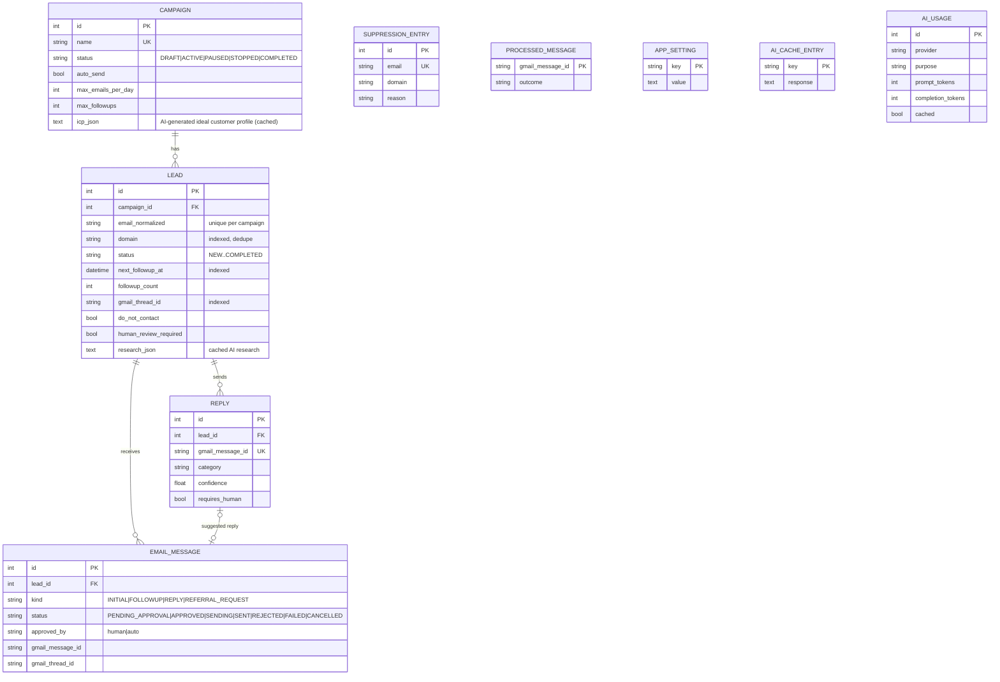
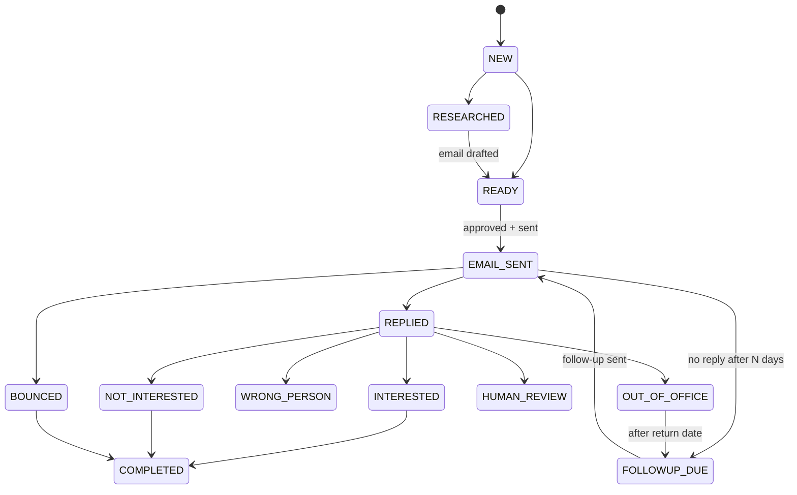

# Architecture & Design Notes

## Guiding principles

1. **€0/month** – SQLite, free-tier LLMs (Gemini / Groq) called over plain REST with `httpx`,
   the official Gmail API, Streamlit locally. No paid SaaS.
2. **AI only where language matters** – research summarisation, email writing, reply
   classification and reply drafting. Everything else (dates, counters, limits, dedupe,
   status transitions, scheduling, bounce/auto-reply detection) is deterministic Python.
3. **Safe by default** – `DEMO_MODE=true` (fake mailbox) and `SAFE_MODE=true` (human approval),
   conservative sending limits, suppression list checked immediately before every send.
4. **Layered & testable** – services receive a DB session, settings, an `AIService` and a
   `GmailClient`, so tests inject fakes for everything external.

## Layers

| Layer | Package | Responsibility |
|-------|---------|----------------|
| Config | `app/config` | typed settings (`pydantic-settings`), JSON logging with secret redaction |
| Data | `app/database` | SQLAlchemy 2.0 models, engine/session, repositories (queries) |
| AI | `app/ai` | `AIProvider` interface, Gemini/Groq/Mock providers, `AIService` (cache, fallback, usage log), compact prompts |
| Email | `app/email` | Gmail OAuth client, fake demo mailbox, MIME building, thread helpers, sender with limits, inbox monitor |
| Leads | `app/leads` | CSV/manual/pasted import, validation, deduplication, status machine, company research |
| Outreach | `app/outreach` | campaigns & ICP, email generation, reply classification & rules, follow-ups, approval queue |
| Jobs | `app/scheduler` | idempotent job functions + a lightweight loop scheduler |
| API | `app/main.py` | optional FastAPI layer (health, stats, job triggers) |
| UI | `dashboard/` | Streamlit dashboard |

## Database design

Key invariants:

* **No double sends** – a message is *claimed* with an atomic
  `UPDATE ... SET status='SENDING' WHERE id=? AND status='APPROVED'` before the Gmail call.
* **No double processing** – every Gmail message id handled by the inbox monitor is stored
  in `processed_messages` in the same transaction as the resulting `Reply`.
* **Suppression is global** – `suppression_entries` is checked right before each send,
  independent of lead status.
* **Daily limit** is derived from `email_messages.sent_at` (source of truth, cannot drift).

## Lead lifecycle

## Implementation roadmap

| Phase | Deliverable | Verification |
|------:|-------------|--------------|
| 1 | Project skeleton, settings, logging, utils | import check |
| 2 | SQLite models, sessions, repositories, status machine | model tests |
| 3 | CSV / manual / pasted import, validation, dedupe | import & dedupe tests |
| 4 | AI provider abstraction (Gemini, Groq, Mock), cache, fallback | provider tests with mocked HTTP |
| 5 | Company research (SSRF-safe fetch, text extraction, AI summary) | research tests with mocked HTTP |
| 6 | Email generation + quality checks + approval queue | generator tests |
| 7 | Gmail OAuth client, demo mailbox, sender with limits | sender/limit tests |
| 8 | Inbox monitor, reply classification, response rules | classifier/rules tests |
| 9 | Follow-up scheduling | follow-up tests |
| 10 | Streamlit dashboard | manual run + smoke import |
| 11 | Full test suite | `pytest` |
| 12 | README, cleanup, final validation | checklist |
